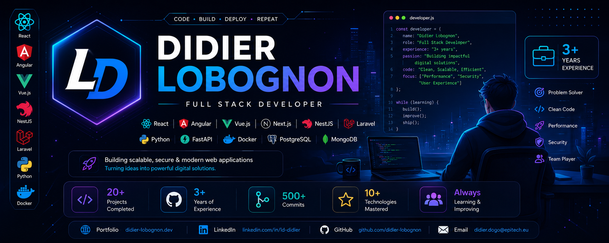

  

<h1 align="center">Hi 👋, I'm Didier Lobognon</h1>

<h3 align="center">
Full Stack Software Engineer | 3+ Years of Experience
</h3>

Building scalable, secure and modern web applications 🚀

---

## 🌍 Connect with me

---

# 👨‍💻 About Me

I'm a **Full Stack Software Engineer** with **3+ years of experience** building scalable enterprise applications.

I specialize in backend development with **Java, Spring Boot, NestJS, Laravel and Python**, while also creating modern front-end interfaces using **React, Angular and Vue.js**.

I enjoy designing secure APIs, scalable architectures and delivering high-performance software.

- 🚀 3+ Years Experience
- ☕ Java & Spring Boot Developer
- ⚡ NestJS & Node.js Developer
- 💻 React / Angular / Vue.js
- 🐳 Docker & Microservices
- 🌍 Abidjan, Côte d'Ivoire
- 📚 Always learning

---

## 🐍 Contribution Snake

  

# 🚀 Tech Stack

---

# 🚀 Featured Projects

## 💳 MasaFinance

FinTech platform built with Microservices Architecture.

---

## 🐣 CouvoirBAF ERP

ERP solution for poultry hatchery management.

---

## 📚 ClasseSTEM

Educational platform dedicated to STEM learning.

---

## 🛒 My Shop

Modern e-commerce platform.

---

## 📊 Dashboard WSC

Interactive dashboard with customizable widgets.

---

# 📈 GitHub Stats

---

# 🔥 GitHub Streak

---

# 📊 Contribution Graph

---

# 🛠 Skills

---

# 📫 Contact

📧 **didier.dogo@epitech.eu**

🌍 **Abidjan, Côte d'Ivoire**

💼 **LinkedIn**

https://www.linkedin.com/in/ld-didier

⭐ Thanks for visiting my GitHub Profile!
